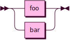
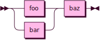

# Notation

Syntax is documented using Extended Backus-Nauer Form (EBNF) and railroad diagrams.

## Node Types
The leaf nodes of the EBNF rules can be strings, regular expressions or other EBNF rules.

```rs
Regex ::= [a-z]+
Rule ::= Foo
Literals ::= 'foo' "bar"
```


## Quantifiers

```rs
one ::= foo
zero_or_one ::= foo?
one_or_more ::= foo+
zero_or_more ::= foo*
```


## Expressions

```rs
alternation ::= foo | bar
concatenation ::= foo bar
group ::= (foo | bar) baz
```





