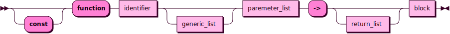

# Functions

```
function ::= "const"? "function" identifier generic_list? paremeter_list "->" return_list? block
```


See:
- [`identifier`]()
- [`generic_list`](#generics)
- [`parameter_list`](#parameter-passing)
- [`return_list`](#returning-values)
- [`block`]()

```

Example:

```r
# declaration
function increment(mut self: int, a: int) -> {
    self += a
    return self
}

mut foo := 40

# a regular function call, all parameters passed by value (usually by copy)
bar := increment(foo, 2)
assert!(foo == 40)
assert!(bar == 42)

# an application, the parameters on the left of the dot ar mutated in-place
foo.increment(2)
assert!(foo == 42)
```

## Parameter Passing

```
parameter_list ::= "(" (parameter ("," parameter)* ","?)? ")"

parameter ::= (|"mut"|"const") identifier (":" type_expression)?
```


See:
- [`identifier`]()
- [`type_expression`]()

Function parameters have two syntaxes: *receivers* and *arguments*. The receivers are mutated in-place instead of being passed by copy, whereas arguments are passed by value. We say that the function is *called* with the arguments, and it is *applied* to the receivers.

The *receivers* appear on the left side of the function call. The *arguments* appear on the right side of the function call.

```r
# a regular call
foo(a, b, c)

# this call can also be written with an explicit receiver list, this makes it
().foo(a, b, c)

# a call with one receiver
(a).foo(b, c)

# the parentheses can be omitted when ther is a single receiver
a.foo(b, c)

# a call with multiple receivers
(a, b).foo(c)
(a, b, c).foo()

# note that it is not allowed to omit the argument list entirely, otherwise there
# would be ambiguity with the syntax for accessing fields.
```

The purpose of this behavior is to allow functions to mutate parameters without introducing first-class references to the language. This forces mutability to always be local, thus making it easier to reason about, both for the programmer and the compiler.

Additionally, application lets us chain function calls, as applying a function to immutable receivers is also perfectly allowed, and behaves exactly the same as calling the function regularly.

```r
# nested function can get hard to read
baz(bar(foo(42)))

# application lets us chain them
42.foo().bar().baz()
```

## Overloading

Generally, functions cannot be overloaded, however it is legal to name two functions the same name, as long as their use is unambiguous at the calling site.

If multiple conflicting definitions are in scope, their use must be disambiguated by qualifying their name.

Traits are defined in terms of the final part of the function's name, so they do not interact with namespacing, they must follow disambiguation just the same.

```r
trait MyTrait {
    function do_something(self) -> ()
}

struct MyType()

mod foo {
    function do_something(self: MyType) -> {}
}

mod bar {
    function do_something(self: MyType) -> {}
}

function do_something_else[T: MyTrait](self: T) -> {
    import foo::*
    import bar::*
    import foo
    import bar

    # not legal!, do_something is ambiguous
    self.do_something()

    # this is okay
    self.foo::do_something()
    self.bar::do_something()
}
```

## Returning Values

```
return_list ::= type_expr | "(" (type_expr ("," type_expr)* ","?)? ")"
```

## Generics

```
generic_list ::= "[" (generic_parameter ("," generic_parameter)* ","?)? "]"

generic_parameter ::= identifier (":" type_expression)?
```


## Compile-Time

## Side-effects

Functions in Dragon cannot normally have side-effects, other than mutating its receivers. That is, all non-local mutability is not allowed by default. This behavior is however not enforced at the semantics level, but rather it is a static lint, that is enabled by default, but it can be overridden.

The types of side-effects that are not normally allowed are the following:
- non-local mutation
- non-thread-local value passing
- panicking
- exiting
- IO
- blocking another thread
- calling another function with side-effects

The compiler does not guarantee that these side-effects will never occur, especially if a function has undefined or unsafe behavior.

Local mutability is allowed in functions. This goes against the definition of pure functions in functional programming, but this is not a functional programming language. It is a procedural language, and we want to be able to mutate things when we explicitly intend to. So the following examples are perfectly fine:

```r
function foo() -> {
    # this is okay, it is local
    mut a := 41
    a += 1
}

function bar(mut a: int) {
    # this is okay, it can only mutate receivers, which is considered local mutation
    # if we call it normally, we are copying the argument
    a += 1
}
```

Other types of side-effects can be enabled by ending the function identifier with a bang, this makes it obvious that a function will do something non-local, and we should be extra careful. Note that closures cannot ever have side-effects.

```r
function greet!() -> {
    println!("Hello!")
}

# Mutex allows shared mutability, so a lot of its functions are marked as having side-effects
static counter := Mutex(0)

function increment_counter!() -> {
    counter.lock!()
}
```

We can mark a function as having side-effects even if the compiler cannot see that it has side-effects. The compiler will raise a warning, which can be disabled globally or case-by-case. This is how the standard library can check for side-effects on types with interior mutability, because it explicitly marks functions that allow non-local mutation with a bang.

We can also force the compiler to accept a regular function even if it thinks it has side effects, by allowing the side effects case-by-case.

```r
# this function is not marked as having side-effects even if the compiler cannot
# prove that it doesn't
function i_know_what_im_doing() -> {
    if false @allow(side_effects) {
        println!("This will never happen!")
    }
}
```

## Attributes and Decorators

Attributes and decorators use the same syntax. The difference is that attributes are compiler intrinsics, whereas decorators are just a special way of calling a function. Attributes are reserved.

The built-in attributes are the following:
- `@allow(something)` allows a lint with the given name within the entire body of the function
- `@warn(something)` raise a warning for a lint with the given name within the entire body of the function
- `@deny(something)` raise a compilation error for a lint with the given name within the entire body of the function
- `@must_use` raise a warning if the return value is silently dropped within the entire body of the function

    Example:
    ```r
    @must_use
    function foo() -> int {
        return 42
    }

    # raises a warning
    foo()

    # does not raise a warning, as we explicitly discard it
    discard foo()
    ```
